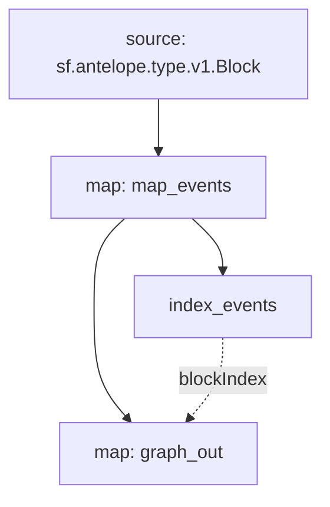

# Antelope Claim Rewards

> Substreams for Antelope Block Producer claim rewards (Block Pay & Vote Pay).

## Quickstart

```
$ gh repo clone pinax-network/substreams-antelope-claimrewards
$ cd substreams-antelope-claimrewards
$ make
$ make gui
```

## Releases

- https://github.com/pinax-network/substreams-antelope-claimrewards/releases

### Mermaid Graph



### Modules

```yaml
Package name: antelope_claimrewards
Version: v0.1.0
Doc: Antelope Block Producer claim rewards (Block Pay & Vote Pay).
Modules:
----
Name: map_events
Initial block: 0
Kind: map
Input: source: sf.antelope.type.v1.Block
Output Type: proto:sf.antelope.type.v1.TransactionTraces
Hash: 1c22c3cb8a845fed5543034d1f92988166ef15e3

Name: index_events
Initial block: 0
Kind: index
Input: map: map_events
Output Type: proto:sf.substreams.index.v1.Keys
Hash: 6ff8db036166afe2e632385f5c5e803048a3ffb4

Name: graph_out
Initial block: 0
Kind: map
Input: map: map_events
Block Filter: (using *index_events*): `&{claimrewards}`
Output Type: proto:sf.substreams.sink.entity.v1.EntityChanges
Hash: 5356733c34aa9dcf949860e29193ad3fd8916545
```
