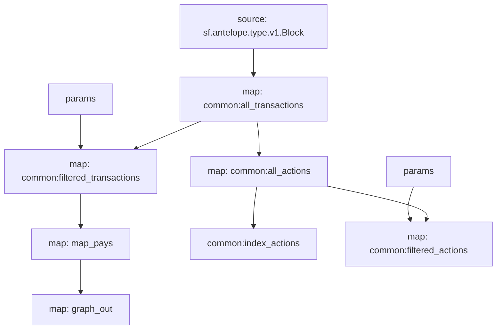

# Antelope Claim Rewards

> Substreams for Antelope Block Producer claim rewards (Block Pay & Vote Pay).

## Quickstart

```
$ gh repo clone pinax-network/substreams-antelope-claimrewards
$ cd substreams-antelope-claimrewards
$ make
$ make gui
```

## Releases

- https://github.com/pinax-network/substreams-antelope-claimrewards/releases

### Mermaid Graph



### Modules

```yaml
Package name: antelope_claimrewards
Version: v0.1.0
Doc: Antelope Block Producer claim rewards (Block Pay & Vote Pay).
Modules:
----
Name: map_pays
Initial block: 0
Kind: map
Input: map: common:filtered_transactions
Output Type: proto:antelope.bps.v1.Pays
Hash: b64fab3af9bcc4bace45dc10a0cc8c496811413e

Name: graph_out
Initial block: 0
Kind: map
Input: map: map_pays
Output Type: proto:sf.substreams.sink.entity.v1.EntityChanges
Hash: 80655d596a546ac022f6ec5ff634a85e9216d7d3

```
