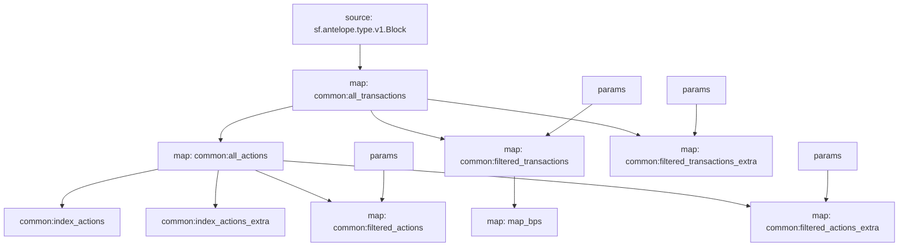

# Antelope BP registrations and rewards substreams

> Substreams for Antelope Block Producer registrations and rewards.

## Quickstart

```
$ git clone https://github.com/pinax-network/antelope-bps-subgraph
$ cd antelope-bps-subgraph/substreams
$ make
$ make gui
```

## Releases

- https://github.com/pinax-network/antelope-bps-subgraph/releases

### Mermaid Graph



### Modules

```yaml
Package name: antelope_bps
Version: v0.3.0
Doc: Antelope Block Producer claim rewards (Block Pay & Vote Pay).
Modules:
----
Name: map_bps
Initial block: 0
Kind: map
Input: map: common:filtered_transactions
Output Type: proto:antelope.bps.v1.Bps
Hash: a7dbfa1576c3ff4035ad0bdeb2e932e5029c9c6a

```
